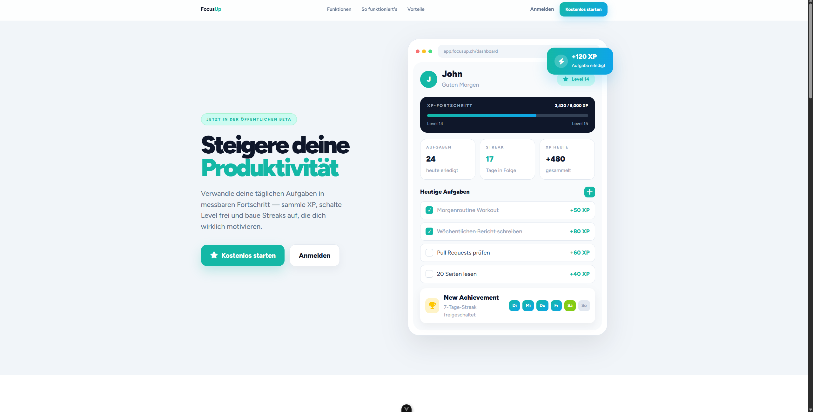
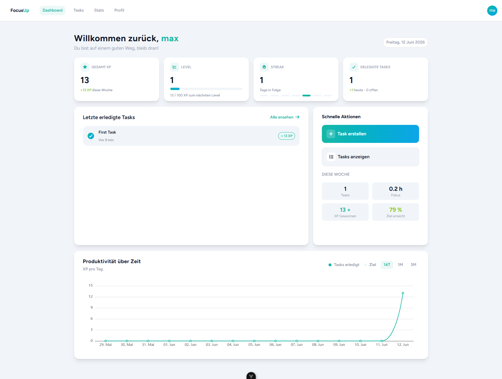

# IPT6.1 – FocusUp


## Live Demo

### [FocusUp Online](https://focusup.up.railway.app)

[Einführungsvideo (nicht auf Github anzeigbar! Downloaden zum ansehen.)](Documentation/Video/Preview_FocusUp.mp4)


## Preview




## Get Started

### Voraussetzungen

Bevor das Projekt gestartet wird, müssen folgende Programme installiert sein:

    - Git
    - Node.js
    - npm
    - .NET SDK
    - SQLite
    - Docker und Docker Compose

### Projekt klonen
```
git clone <repository-url> 
cd <repository-name>
cd .\Project\
```

### File anpassen
```
- File umbennenen (./Project)
    .env.example -> .env
- File umbennenen (./Project/Frontend/focusUp)
    .env.example -> .env
- File umbennen und Secret setzen (./Project/Backend/FocusUp)
    appsettings.example.json -> appsettings.json
```

### Starten mit Docker
Der einfachste Weg ist das Starten über Docker Compose.

```
docker compose up --build
```

Danach sind die Services erreichbar unter:
```
Frontend: http://localhost:5173 
Backend: http://localhost:5165
```

## Über das Projekt

**FocusUp** ist eine webbasierte Produktivitätsplattform, die klassische Aufgabenverwaltung mit Gamification kombiniert.

Viele To-Do-Anwendungen helfen zwar beim Organisieren von Aufgaben, bieten jedoch wenig Motivation, diese tatsächlich zu erledigen. FocusUp löst dieses Problem durch spielerische Elemente wie XP, Level, Streaks und Badges, welche den Fortschritt sichtbar machen und Nutzer langfristig motivieren.

Die Anwendung läuft vollständig im Browser und ermöglicht es Benutzern, ihre Aufgaben zu verwalten, Fortschritte zu verfolgen und produktive Gewohnheiten aufzubauen.

---

## Projektziel

Ziel des Projekts ist die Entwicklung einer modernen Full-Stack-Webanwendung, welche Produktivität und Motivation miteinander verbindet.

Durch die Integration von Gamification-Mechaniken soll die tägliche Aufgabenbearbeitung interessanter und motivierender gestaltet werden.

Benutzer werden für ihre Fortschritte belohnt und können ihre Produktivität anhand von Statistiken und Erfolgen nachvollziehen.

---

## Funktionen

### Aufgabenverwaltung

* Aufgaben erstellen, bearbeiten und löschen
* Aufgaben als erledigt markieren
* Prioritäten festlegen
* Schwierigkeitsgrade definieren
* Übersichtliche Aufgabenlisten

### XP- und Levelsystem

* Erfahrungspunkte (XP) für erledigte Aufgaben erhalten
* Automatische Levelaufstiege
* Sichtbarer Fortschritt durch Fortschrittsbalken

### Streak-System

* Tägliche Aktivitätsstreaks
* Motivation zur kontinuierlichen Nutzung
* Belohnung für Regelmässigkeit

### Badge-System

* Freischaltbare Erfolge
* Verschiedene Seltenheitsstufen
* Versteckte Achievements

### Statistiken

* Erledigte Aufgaben
* Gesammelte XP
* Aktuelle Streaks
* Persönliche Produktivitätsübersicht

### Benutzerverwaltung

* Registrierung
* Login
* JWT-basierte Authentifizierung
* Persönliches Benutzerprofil

---


## Dokumentation

Die vollständige Projektdokumentation befindet sich im Ordner `Documentation/DocumentationPhases`.

### Analyse & Planung

- [Projektbeschreibung](Documentation/DocumentationPhases/0_project-name.md)
- [Features](Documentation/DocumentationPhases/1_features.md)
- [XP-System](Documentation/DocumentationPhases/2_xp-system.md)
- [Streak-System](Documentation/DocumentationPhases/3_streak-system.md)
- [Level-System](Documentation/DocumentationPhases/4_level-system.md)
- [Use Cases](Documentation/DocumentationPhases/5_use-cases.md)

### Datenbank

- [Datenbankkonzept](Documentation/DocumentationPhases/6_concept_db.md)
- [ERM Beschreibung](Documentation/DocumentationPhases/7_descripting_ERM.md)
- [ER Diagramm](Documentation/Diagram/DB-Diagram/ER_Diagramm.png)
- [ERM Diagramm](Documentation/Diagram/DB-Diagram/ERM_Diagramm.png)

### Frontend & UI

- [UML Beschreibung](Documentation/DocumentationPhases/8_uml-diagram.md)
- [UML Diagramm Entitäten](Documentation/Diagram/DB-Diagram/UML_Diagramm_Entity.png)
- [UI Diagramm Repositories](Documentation/Diagram/DB-Diagram/UML_Diagramm_Repositories.png)
- [UI Diagramm Services & Repositories](Documentation/Diagram/DB-Diagram/UML_Diagramm_Services&Repositories.png)
- [(PAP)BenutzerLogin](Documentation/Diagram/Pap/(PAP)BenutzerLogin.png)
- [(PAP)Level bestimmen](Documentation/Diagram/Pap/(PAP)Level%20bestimmen.png)
- [(PAP)Task erledigen](Documentation/Diagram/Pap/(PAP)Task%20erledigen.png)
- [(PAP)XP berechnen](Documentation/Diagram/Pap/(PAP)XP%20berechnen.png)
- [Seitenstruktur](Documentation/DocumentationPhases/9_page-structure.md)
- [Page Style Entscheidung](Documentation/DocumentationPhases/10_decide-pagestyle.md)
- [Frontend Struktur](Documentation/DocumentationPhases/11_frontend_dev_structure.md)

### Backend

- [Backend Endpoints Übersicht](Documentation/DocumentationPhases/12_overview_backend-endpoints.md)
- [Backend Testing](Documentation/DocumentationPhases/13_backend_testing.md)
- [Badge Entscheidungen](Documentation/DocumentationPhases/14_badge-decision.md)
- [Unit- und Integrationstests](Documentation/DocumentationPhases/15_backend_unit-integration-testing.md)

### Deployment

- [Deployment Dokumentation](Documentation/DocumentationPhases/16_deployment_documentation.md)

---

## Systemarchitektur

```text
┌─────────────────────┐
│      Frontend       │
│     Vue 3 + Vite    │
└──────────┬──────────┘
           │ REST API
           ▼
┌─────────────────────┐
│      Backend        │
│ ASP.NET Core WebAPI │
└──────────┬──────────┘
           │
           ▼
┌─────────────────────┐
│      SQLite DB      │
└─────────────────────┘
```

---

## Verwendete Technologien

### Frontend

* Vue 3
* TypeScript
* Vite
* Pinia
* Tailwind CSS
* ECharts

Weitere Informationen:

[Frontend Dokumentation](Project/Frontend/focusUp/README.md)

### Backend

* ASP.NET Core Web API
* JWT Authentication
* SQLite

### Infrastruktur

* Docker
* Docker Compose

---

## Verfügbarkeit

Die Anwendung ist öffentlich über Railway erreichbar.

### Live Demo

[FocusUp](https://focusup.up.railway.app)

### Deployment

Das Projekt wird automatisch über Railway deployed. Änderungen am Hauptbranch werden nach erfolgreichem Build automatisch veröffentlicht.

---

## Troubleshooting

### Erster Versuch:
```
docker compose down -v --remove-orphans
docker compose up --build
```

### Wenn nicht funktioniert dann:
```
docker compose down -v --remove-orphans
rm Database/productivity_game.sqlite
docker compose up --build
```
Hinweis: Der Befehl `rm Database/productivity_game.sqlite` kann einen Fehler auslösen. In diesem Fall muss im Windows Defender die Berechtigung erteilt werden, damit die Datei gelöscht werden darf.


## Entwickler

Projektarbeit im Rahmen des Moduls IPT 6.1.

Entwickelt von:

* Sanjivan
* Egor

---

## Lizenz

Dieses Projekt wurde zu Ausbildungszwecken entwickelt und dient ausschliesslich Lern-, Demonstrations- und Bewertungszwecken.
